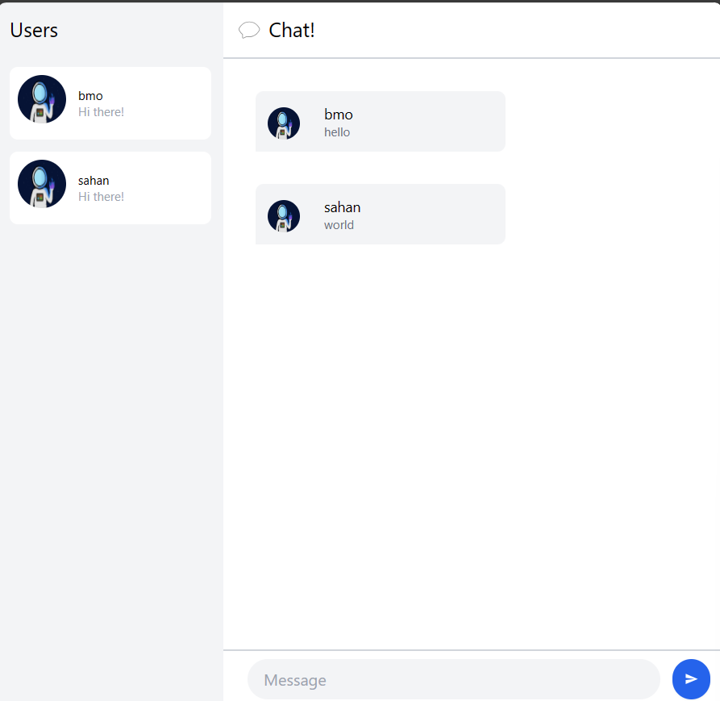

# Tutorial 3 Module 10

3.1. Original code

 3.2. Add some creativities to the webclient 

Terlihat pada gambar di atas, adanya perubahan pada _default_ dari _profile picture_ menjadi gambar yang baru. 

